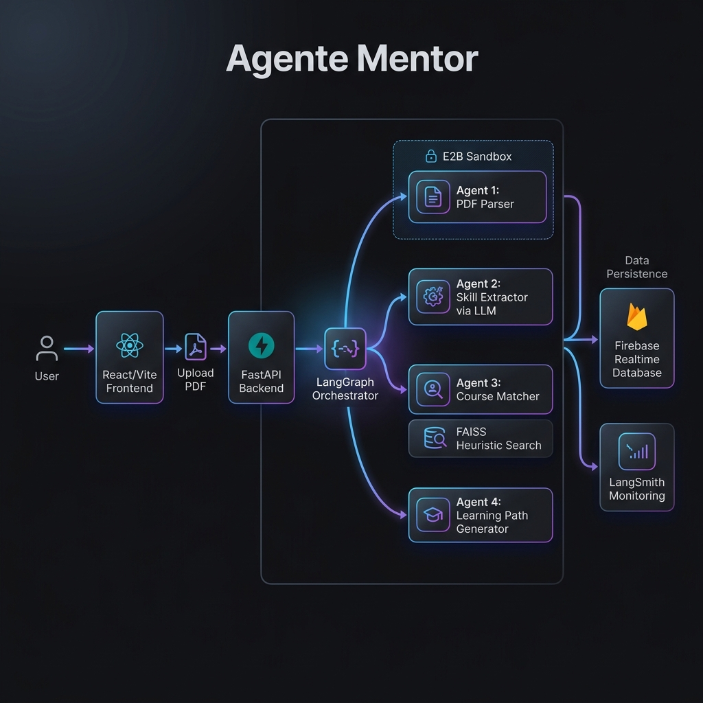

# 🎓 Agente Mentor — Multi-Agent AI Learning Path Generator

> Sistema multi-agente basado en **LangGraph** que analiza CVs en PDF y genera rutas de aprendizaje personalizadas. Evaluado con **LangSmith** sobre datos reales de LinkedIn.

[](https://python.org)
[](https://langchain-ai.github.io/langgraph/)
[](https://fastapi.tiangolo.com)
[](https://smith.langchain.com)
[](LICENSE)

---

## 📋 Tabla de Contenidos

- [Descripción General](#-descripción-general)
- [Arquitectura del Sistema](#-arquitectura-del-sistema)
- [Tech Stack](#-tech-stack)
- [Estructura del Proyecto](#-estructura-del-proyecto)
- [Setup e Instalación](#-setup-e-instalación)
- [Ejecutar el Sistema](#-ejecutar-el-sistema)
- [API Reference](#-api-reference)
- [Framework de Evaluación](#-framework-de-evaluación)
- [Resultados Experimentales](#-resultados-experimentales)
- [Posibles Mejoras](#-posibles-mejoras)

---

## 📖 Descripción General

**Agente Mentor** es un pipeline de inteligencia artificial que automatiza la generación de rutas de aprendizaje personalizadas a partir de CVs profesionales. El sistema:

1. **Parsea** un CV en PDF y extrae el texto de forma segura mediante un **Sandbox de E2B**
2. **Extrae** habilidades técnicas y nivel de seniority mediante un LLM
3. **Matchea** cursos relevantes usando búsqueda vectorial (FAISS) sobre Firebase con reranking heurístico
4. **Genera** una ruta pedagógica ordenada y adaptada al perfil del candidato

El sistema fue validado con **21 experimentos en LangSmith** sobre 7 CVs reales de LinkedIn, demostrando una mejora del **52% en calidad E2E** entre el Baseline y la Arquitectura Final.

---

## 🏛️ Arquitectura del Sistema

```
                         PDF Upload
                              │
                 ┌────────────▼────────────┐
                 │   FastAPI  (port 8000)  │
                 └────────────┬────────────┘
                              │
                 ┌────────────▼────────────────────────────┐
                 │         LangGraph Pipeline              │
                 │                                         │
                 │  ┌─────────────┐   ┌─────────────────┐ │
                 │  │  Agente 1   │──►│    Agente 2      │ │
                 │  │ PDF Parser  │   │ Skill Extractor  │ │
                 │  │(E2B Sandbox)│   │  (LLM: Claude /  │ │
                 │  └─────────────┘   │   GPT-4o-mini)  │ │
                 │                    └────────┬─────────┘ │
                 │                             │           │
                 │  ┌─────────────┐   ┌────────▼─────────┐ │
                 │  │  Agente 4   │◄──│    Agente 3      │ │
                 │  │ Learning    │   │ Course Matcher   │ │
                 │  │ Path Gen.   │   │ FAISS + Heurístic│ │
                 │  └──────┬──────┘   └──────────────────┘ │
                 └─────────┼───────────────────────────────┘
                           │
                ┌──────────▼──────────┐
                │  Firebase Realtime  │
                │      Database       │
                └──────────┬──────────┘
                           │
                ┌──────────▼──────────┐
                │   React Frontend    │
                │  (Vite + Tailwind)  │
                └─────────────────────┘
```



### Componente Clave: Reranking Heurístico (Agente 3)

El módulo de Course Matching combina **búsqueda vectorial semántica** (FAISS) con **filtros heurísticos** basados en nivel, dominio y brechas de habilidades del candidato. Esta arquitectura produjo un salto del **0.79 → 0.90 en Efectividad de Ruta**.

---

## 🛠️ Tech Stack

| Capa | Tecnología |
|------|-----------|
| Orquestación | LangGraph 0.1.x |
| LLM | AWS Bedrock (Claude 3.5 Haiku) _o_ OpenAI GPT-4o-mini |
| Embeddings | OpenAI `text-embedding-3-small` |
| PDF Parsing | E2B Code Interpreter (Sandbox) + pdfplumber |
| Vector Store | FAISS (o Chroma, configurable) |
| Base de Datos | Firebase Realtime Database |
| API | FastAPI + Uvicorn |
| Frontend | React 18 + Vite + Tailwind CSS |
| Evaluación | LangSmith (trazabilidad + métricas) |
| Entorno | Miniconda + Python 3.11 |

> [!NOTE]
> Aunque el sistema es agnóstico al proveedor, todos los resultados y métricas presentados en este repositorio fueron obtenidos utilizando **AWS Bedrock (Claude 3.5 Haiku)** como motor principal.

---

## 📂 Estructura del Proyecto

```
agente-mentor/
├── backend/
│   ├── agents/
│   │   ├── pdf_parser_agent.py          # Agente 1: PDF → texto
│   │   ├── skill_extraction_agent.py    # Agente 2: texto → habilidades (LLM)
│   │   ├── course_matching_agent.py     # Agente 3: habilidades → cursos (FAISS + Heurística)
│   │   └── learning_path_agent.py       # Agente 4: cursos → ruta pedagógica (LLM)
│   ├── api/
│   │   ├── main.py                      # Aplicación FastAPI
│   │   └── routes/
│   │       ├── cv.py                    # POST /upload-cv
│   │       └── learning_path.py         # GET /learning-path/:id
│   ├── core/
│   │   ├── graph.py                     # Definición del StateGraph de LangGraph
│   │   └── state.py                     # AgentState (TypedDict compartido)
│   ├── config/settings.py               # Configuración Pydantic-settings
│   ├── db/seed_courses.py               # Seed de Firebase + índice FAISS
│   ├── prompts/
│   │   ├── skill_extraction.py          # Prompts del Agente 2 (v1, v2, v3)
│   │   └── learning_path.py             # Prompts del Agente 4
│   ├── evaluations/
│   │   ├── dataset_builder.py           # Constructor del dataset en LangSmith
│   │   ├── evaluators/
│   │   │   ├── skill_extraction_evaluator.py    # Juez LLM: Agente 2
│   │   │   ├── learning_path_evaluator.py       # Juez LLM: Agente 4
│   │   │   └── system_quality_evaluator.py      # Juez LLM: E2E
│   │   ├── runners/
│   │   │   ├── run_skills_eval.py               # Ejecuta evaluación Agente 2
│   │   │   ├── run_skills_experiments.ps1        # Lanza experimentos de Skills (3 versiones)
│   │   │   ├── run_path_eval.py                  # Ejecuta evaluación Agente 4
│   │   │   ├── run_lp_experiments.ps1            # Lanza experimentos de Learning Path
│   │   │   ├── run_e2e_eval.py                   # Ejecuta evaluación E2E completa
│   │   │   └── run_e2e_experiments.ps1           # Lanza experimentos E2E
│   │   ├── reports/
│   │   │   ├── reporte_agente_1_extraccion.py    # Gráfica: Skills (Agente 2)
│   │   │   ├── reporte_agente_3_evolucion_lp.py  # Gráfica: Evolución LP
│   │   │   ├── reporte_detallado_real_world.py   # Gráfica: CVs reales por candidato
│   │   │   └── reporte_sistema_e2e.py            # Gráfica: Sistema E2E completo
│   │   └── real_world/
│   │       ├── run_real_world_eval.py             # Runner evaluación masiva real
│   │       ├── bulk_evaluate_cvs.py               # Evaluación por lotes
│   │       ├── cvs_to_test/                       # 7 CVs reales de LinkedIn (PDF)
│   │       ├── DEBUG_evaluate_single_pdf.py       # ⚠️ Solo debugging
│   │       └── DEBUG_fast_test_cv.py              # ⚠️ Solo debugging
│   ├── schemas/                         # Modelos Pydantic
│   ├── services/                        # pdf_service, llm_service, firebase, vector_store
│   ├── utils/logger.py
│   ├── start_server.ps1                 # Script de arranque rápido (Windows)
│   ├── .env.example                     # Plantilla de variables de entorno
│   └── 1_rendimiento_extraccion_habilidades.png   # Resultados de evaluación
│   └── 2_evolucion_arquitectura_pedagogica.png
│   └── 3_evaluacion_detallada_cvs_reales.png
│   └── 4_rendimiento_sistema_completo.png
│   └── 5_arquitectura_sistema_completo.png
├── frontend/
│   ├── src/
│   │   ├── components/     # CVUpload, SkillsDisplay, LearningPath, etc.
│   │   ├── pages/          # HomePage, ResultsPage
│   │   └── services/api.js
│   └── package.json
├── environment.yml
└── README.md
```

---

## ⚙️ Setup e Instalación

### Prerrequisitos

- [Miniconda](https://docs.conda.io/en/latest/miniconda.html) o Anaconda
- Cuenta de [Firebase](https://firebase.google.com) con Realtime Database habilitado
- API key de **OpenAI** _o_ credenciales de **AWS Bedrock** (IAM con permiso `bedrock:InvokeModel`)
- Cuenta de **[E2B](https://e2b.dev)** (para extracción segura en Sandbox)
- Cuenta de [LangSmith](https://smith.langchain.com) (para trazabilidad y evaluaciones)
- Node.js 18+ (para el frontend)

---

### 1 — Crear el entorno Conda

```bash
conda env create -f environment.yml
conda activate cv-analyzer
```

---

### 2 — Configurar Variables de Entorno

```bash
cd backend
cp .env.example .env
```

Edita `.env` con tus valores. Variables mínimas requeridas:

```env
# Proveedor LLM: "openai" o "bedrock"
LLM_PROVIDER=bedrock

# Si usas OpenAI:
OPENAI_API_KEY=sk-...
OPENAI_MODEL=gpt-4o-mini

# Si usas AWS Bedrock (Claude):
AWS_ACCESS_KEY_ID=...
AWS_SECRET_ACCESS_KEY=...
AWS_REGION=us-east-1
BEDROCK_MODEL_ID=anthropic.claude-3-5-haiku-20241022-v1:0

# Firebase:
FIREBASE_CREDENTIALS_PATH=./config/firebase_credentials.json
FIREBASE_DATABASE_URL=https://<tu-proyecto>.firebaseio.com

# LangSmith (evaluaciones):
LANGCHAIN_TRACING_V2=true
LANGCHAIN_API_KEY=ls__...
LANGCHAIN_PROJECT=agente-mentor

# E2B Sandbox (Seguridad):
E2B_API_KEY=e2b_...
```

---

### 3 — Configurar Firebase

1. Ve a [Firebase Console](https://console.firebase.google.com) → Crea un proyecto
2. Habilita **Realtime Database**
3. Ve a **Project Settings → Service Accounts → Generar nueva clave privada**
4. Guarda el JSON descargado en `backend/config/firebase_credentials.json`
5. Copia la URL de la base de datos a `FIREBASE_DATABASE_URL` en `.env`

---

### 4 — Poblar Firebase y construir índice FAISS

```bash
cd backend
python db/seed_courses.py
```

Este comando sube el catálogo de cursos a Firebase y construye el índice vectorial en `./db/faiss_index`.

---

## 🚀 Ejecutar el Sistema

### Backend

```bash
cd backend

# Opción A: Script de arranque (Windows)
.\start_server.ps1

# Opción B: Manual
uvicorn api.main:app --reload --port 8000
```

API disponible en: `http://localhost:8000`  
Documentación interactiva: `http://localhost:8000/docs`

### Frontend

```bash
cd frontend
npm install
npm run dev
```

Frontend disponible en: `http://localhost:5173`

---

## 📡 API Reference

### `POST /api/v1/upload-cv`
Sube un CV en PDF. Devuelve un `session_id` de inmediato; el procesamiento corre en background.

**Request:** `multipart/form-data` con campo `file` (PDF, máx. 10 MB)

**Response:**
```json
{
  "session_id": "uuid",
  "filename": "mi-cv.pdf",
  "status": "processing",
  "message": "CV recibido. Análisis iniciado..."
}
```

---

### `GET /api/v1/job-status/{session_id}`
Consulta el estado del pipeline. Hacer polling hasta recibir `completed` o `failed`.

```json
{ "status": "processing" }
{ "status": "completed", "learning_path": { ... } }
{ "status": "failed", "errors": ["..."] }
```

---

### `GET /api/v1/learning-path/{session_id}`
Devuelve la ruta de aprendizaje completa persistida en Firebase.

---

### `POST /api/v1/index-courses`
Re-indexa todos los cursos de Firebase → FAISS en background.

---

## 🧪 Framework de Evaluación

El sistema incluye un framework completo de evaluación basado en **LangSmith** con jueces LLM que puntúan entre 0.0 y 1.0.

### Métricas evaluadas

| Métrica | Agente | Descripción |
|---------|--------|-------------|
| `technical_fidelity` | Agente 2 | Las habilidades extraídas son reales y precisas |
| `gap_pertinence` | Agente 2 | Las brechas de habilidades son relevantes al objetivo |
| `seniority_consistency` | Agente 2 | El nivel de seniority asignado es coherente con el CV |
| `path_effectiveness` | Agente 4 | La ruta cubre los gaps de habilidades reales |
| `logical_order` | Agente 4 | Los pasos siguen un orden pedagógico correcto |
| `overall_mentor_quality` | Sistema E2E | Calidad global del mentor |

---

### Ejecutar experimentos

```bash
cd backend

# Iteraciones de Skills (Agente 2) — Compara 3 versiones de prompt
.\evaluations\runners\run_skills_experiments.ps1

# Iteraciones de Learning Path (Agente 4) — Baseline vs Prompt V3 vs Reranking
.\evaluations\runners\run_lp_experiments.ps1

# Evaluación E2E completa (Baseline vs Arquitectura Final)
.\evaluations\runners\run_e2e_experiments.ps1
```

---

### Generar gráficas de resultados

```bash
cd backend

# Gráfica 1: Rendimiento de extracción de habilidades (Agente 2)
python -m evaluations.reports.reporte_agente_1_extraccion

# Gráfica 2: Evolución de la arquitectura del Learning Path
python -m evaluations.reports.reporte_agente_3_evolucion_lp

# Gráfica 3: Evaluación detallada por candidato real
python -m evaluations.reports.reporte_detallado_real_world

# Gráfica 4: Rendimiento E2E del sistema completo (Calidad vs. Latencia vs. Tokens)
python -m evaluations.reports.reporte_sistema_e2e
```

Las imágenes de alta resolución se guardan en `backend/` con el prefijo numérico `1_`, `2_`, `3_`, `4_`.

---

### Herramientas de debugging (solo diagnóstico)

```bash
# Evaluar un CV individual y ver el flujo completo en consola
python -m evaluations.real_world.DEBUG_evaluate_single_pdf \
    --pdf evaluations/real_world/cvs_to_test/AI_Engineer_Wilson.pdf \
    --objective "AI Engineer"

# Test rápido con todas las métricas en un solo CV
python -m evaluations.real_world.DEBUG_fast_test_cv Data_Analyst_Angel.pdf
```

> ⚠️ **Nota:** Los archivos con prefijo `DEBUG_` son solo para diagnóstico local y no registran datos en LangSmith.

---

## 📊 Resultados Experimentales

Evaluación sobre **7 CVs reales de LinkedIn** (21 corridas en LangSmith):

### Evolución de la Arquitectura — Learning Path

| Fase | Orden Lógico | Efectividad de Ruta |
|------|:---:|:---:|
| 1. Baseline V1 | 0.67 | 0.80 |
| 2. Prompt V3 (Solo Prompting) | 0.73 | 0.79 |
| **3. Arquitectura Final (V3 + Reranking)** | **0.74** | **0.90** |

### Sistema Completo (E2E)

| Arquitectura | Calidad E2E | Latencia | Tokens Promedio |
|---|:---:|:---:|:---:|
| Baseline | 0.53 | 16.6s | ~3.8k |
| **Arquitectura Final** | **0.81** | 18.8s | ~4.6k |

> La integración del **Reranking Heurístico** en el Agente 3 es la mejora arquitectónica más impactante, produciendo un salto del **+52% en calidad E2E** con solo +2 segundos de latencia adicionales y un costo operativo mínimamente mayor.

---

## 💡 Posibles Mejoras

| Área | Sugerencia |
|------|-----------|
| Autenticación | JWT en la API para multi-tenant |
| Caché | Redis para resultados de jobs + respuestas LLM |
| Cola de Tareas | Celery / SQS para procesamiento asíncrono escalable |
| Multiidioma | Detección automática de idioma del CV y ajuste de prompts |
| Streaming | Stream de la ruta generada al frontend vía SSE |
| Docker | `Dockerfile` + `docker-compose` para arranque en un comando |
| Catálogo | Conectar a APIs de MOOCs (Coursera, Udemy) para cursos en tiempo real |
| Tests | Pytest + mocked LLM para pruebas unitarias de agentes |

---

## 📄 Licencia

MIT — ver [LICENSE](LICENSE) para detalles.
