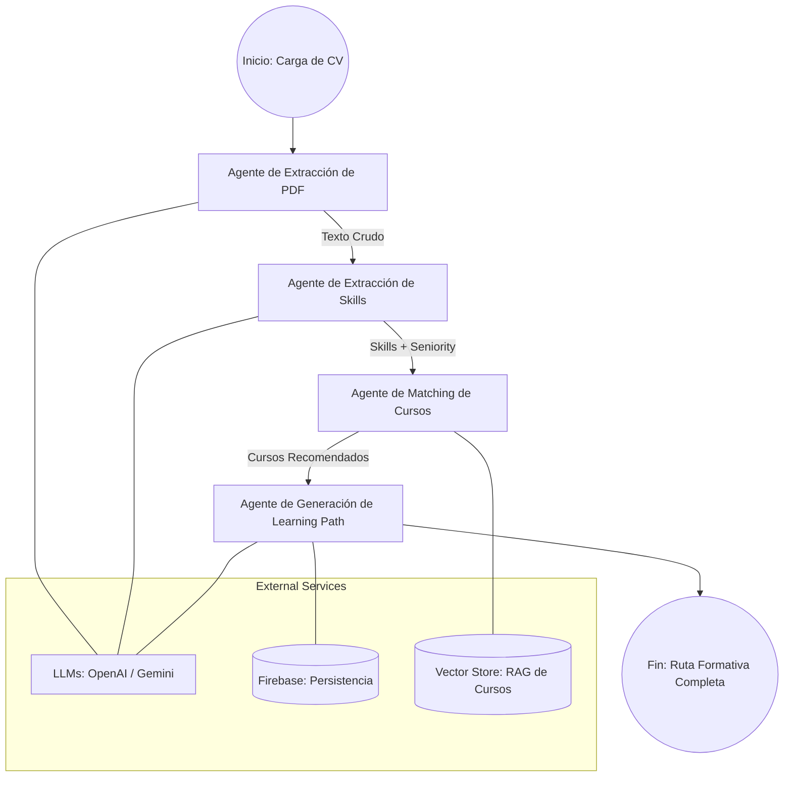

# Arquitectura del Proyecto: AI Mentor

Esta documentación describe la arquitectura técnica del sistema **AI Mentor**, un agente inteligente diseñado para analizar currículums (CVs) y generar rutas de aprendizaje personalizadas hacia objetivos profesionales específicos.

## Vista General

El sistema sigue una arquitectura de **Micro-agentes Orquestados** con un frontend moderno y un backend asíncrono.

## Componentes Principales

### 1. Frontend (Capa de Interacción)
- **Tecnologías:** React + Vite + Tailwind CSS.
- **Función:** Interfaz de usuario intuitiva para la carga de PDFs, definición de objetivos profesionales y visualización dinámica de la ruta de aprendizaje generada.
- **Comunicación:** Consume la API de FastAPI mediante peticiones HTTP (REST) y sondeo (polling) para actualizaciones de estado.

### 2. Capa de API (Backend)
- **Tecnologías:** FastAPI (Python).
- **Función:** Punto de entrada para la carga de archivos, gestión de sesiones y ejecución de tareas en segundo plano (`BackgroundTasks`) para no bloquear al usuario durante el procesamiento de IA.

### 3. Orquestación de Agentes (Capa de Inteligencia)
El núcleo del sistema utiliza **LangGraph** para gestionar un flujo determinista y robusto de agentes especializados.

#### Flujo de Agentes:
1.  **PDF Parser:** Extrae el contenido textual y estructural del PDF del usuario.
2.  **Skill Extraction Agent:** Analiza el texto para identificar habilidades actuales, nivel de seniority y brechas (gaps) respecto al objetivo profesional.
3.  **Course Matching Agent:** Utiliza **RAG (Retrieval-Augmented Generation)** consultando un Vector Store para encontrar los cursos más relevantes que cubren los "gaps" identificados.
4.  **Learning Path Generator:** Estructura toda la información en un plan de estudios lógico, con hitos, tiempos estimados y justificaciones pedagógicas.

### 4. Servicios de Infraestructura
- **Firebase:** Almacenamiento de sesiones, archivos y metadatos de los usuarios.
- **Vector Store (ChromaDB/Pinecone):** Indexación semántica de catálogos de cursos para búsquedas rápidas por relevancia.
- **LLM Service:** Capa de abstracción que permite alternar entre modelos (GPT-4o, Claude 3.5 Sonnet, Gemini 1.5 Flash) según el costo y la latencia necesarios.

## Funcionamiento en Tiempo Real
1. El usuario sube su CV y define un objetivo (ej: "Senior AI Engineer").
2. El sistema devuelve un `session_id` inmediatamente.
3. El pipeline de **LangGraph** se inicia de forma asíncrona.
4. El frontend consulta periódicamente `/job-status/{session_id}`.
5. Una vez completado, el estado compartido (`AgentState`) se transforma en una respuesta JSON estructurada que el frontend renderiza.

---
> [!TIP]
> Esta arquitectura permite alta modularidad: cada agente puede ser mejorado o reemplazado sin afectar al resto del sistema, siempre que respeten el esquema de datos definido en `AgentState`.

---

## Inmersión: Funcionamiento de los Agentes

A continuación se detalla la lógica interna de cada componente del pipeline de IA.

### 1. PDF Parser Agent (The Reader)
Este agente es el encargado de la ingesta de datos. No utiliza IA generativa para garantizar la fidelidad absoluta del texto extraído.

- **Entrada:** Ruta del archivo PDF en el servidor.
- **Proceso:** Utiliza servicios de extracción de bajo nivel (`pdf_service`) para convertir estructuras binarias de PDF en un flujo de texto limpio (`cv_text`).
- **Salida:** Texto plano listo para ser procesado semánticamente.

### 2. Skill Extraction Agent (The Profiler)
Utiliza modelos de lenguaje de gran escala (LLM) para estructurar la información no estructurada del CV.

- **Entrada:** Texto del CV + Objetivo Profesional del usuario.
- **Proceso:** El LLM actúa como un analista de talento, categorizando habilidades existentes y contrastándolas con el objetivo para identificar "Brechas de Conocimiento" (Skill Gaps).
- **Salida:** Perfil estructurado en JSON (Skills actuales, Gaps, Seniority, Años de Experiencia).

### 3. Course Matching Agent (The Searcher - RAG)
Implementa un patrón de **RAG (Retrieval-Augmented Generation)** avanzado con re-ranking heurístico.

- **Entrada:** Lista de brechas (Gaps) y seniority.
- **Proceso:**
    1. **Multi-Query:** Genera múltiples consultas semánticas basadas en las habilidades faltantes.
    2. **Vector Search:** Busca en una base de datos vectorial (ChromaDB/FAISS) donde se han indexado miles de cursos.
    3. **Heuristic Re-ranking:** Aplica un algoritmo de puntuación propio que prioriza cursos fundamentales si el usuario está en transición, o avanzados si busca especialización.
- **Salida:** Top 8 cursos más relevantes y pedagógicamente coherentes.

### 4. Learning Path Generator (The Architect)
Ensambla todas las piezas en un plan de acción ejecutable.

- **Entrada:** Perfil del candidato + Cursos seleccionados.
- **Proceso:** Organiza los cursos en fases secuenciales (Hitos), calcula tiempos estimados de compleción y redacta un resumen ejecutivo que justifica la ruta seleccionada.
- **Persistencia:** Guarda el resultado final en **Firebase** para que el usuario pueda consultarlo en el futuro.
- **Salida:** Objeto `LearningPath` completo consumido por el Frontend.
